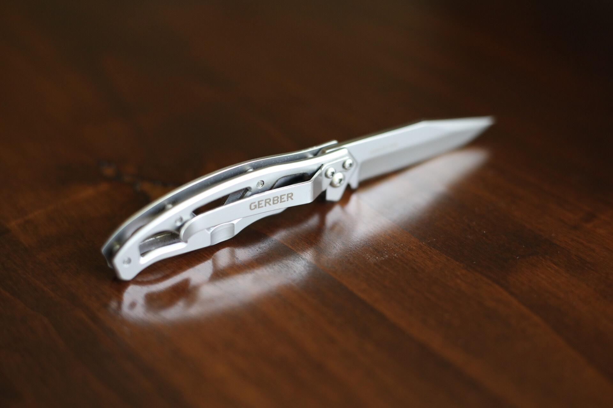

I've never really been one to carry a pocket knife around. That is until my wife got me a mini Swiss Army knife for Christmas this past year. it was one of those really tiny ones, and if fit perfectly in the little coin pocket in the front of a pair of pants.

I liked the little knife, and the scissors came in handy a lot. But, I left it on a bench in the locker room one day, and never saw it again. Instead of just getting the same knife as a replacement I thought I'd check to see what else was out there. That's when I came across the [Gerber Paraframe Mini.](https://amzn.to/2HLrs1E)

<figure>

<figcaption>

Gerber Paraframe Mini Knife

</figcaption>

</figure>

I was looking for a small everyday carry (EDC) knife that was small enough to fit in that little pocket in my jeans, but also had some weight to it. That's one thing I didn't like about the Swiss Army knife; it felt a bit frail and like it wouldn't be able to stand up to more than opening letters and Amazon boxes.

<figure>

<figcaption>

A small clip is built into the frame

</figcaption>

</figure>

The Gerber Paraframe Mini was exactly what I was looking for. Small and lightweight, but solid. It even has a little clip built into it. I've had it for several months now and it's been the perfect EDC knife.
