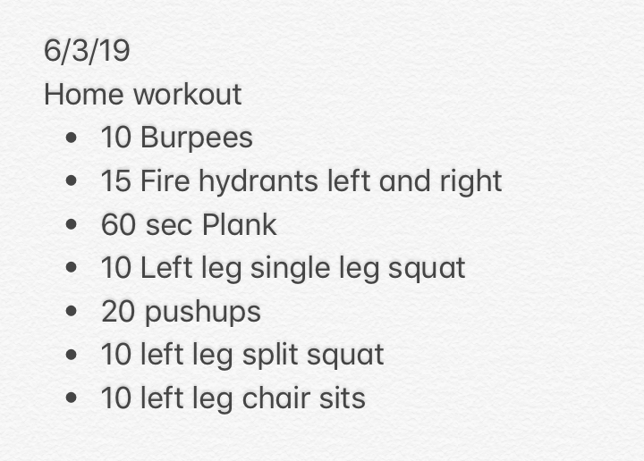

This whole second kid thing is just about killing me. Sleep deprivation is real, and I'm scrambling to fulfill my duties at home, get my actual job work done, and maintain some kind of fitness. My [dad fitness](http://joelgaff.com/blog/dad-fitness) is in full effect, and today was a prime example of that.

<figure>

<figcaption>

Planking in the playroom

</figcaption>

</figure>

It was a long day and my dad/husband duties trumped all else, and as I put the rest of the house to sleep, it was around 11:00 pm and I needed to get a strength/core workout in. So, I threw together some of my go-to exercises, threw the ceiling fan on high, and got to it.

I never thought I'd have to get my workout done in my kids' playroom, but here I am. I did this a few times through and 30 minutes or so later I checked off my workout for the day. As you can see, I'm a little heavy on the left leg stuff. I'm rehabbing a weak quad/hip, so the focus is on that side of the body. [Streak](http://joelgaff.com/blog/im-a-streaker) still alive after 88 days.
