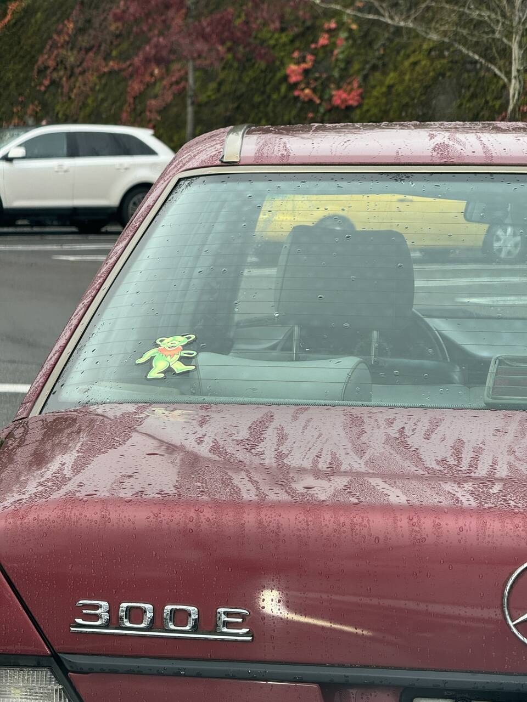
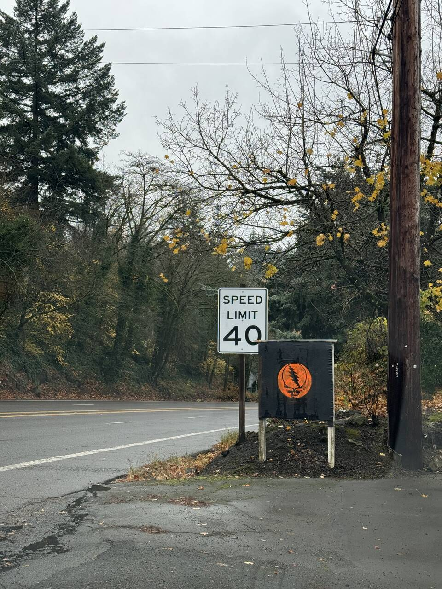
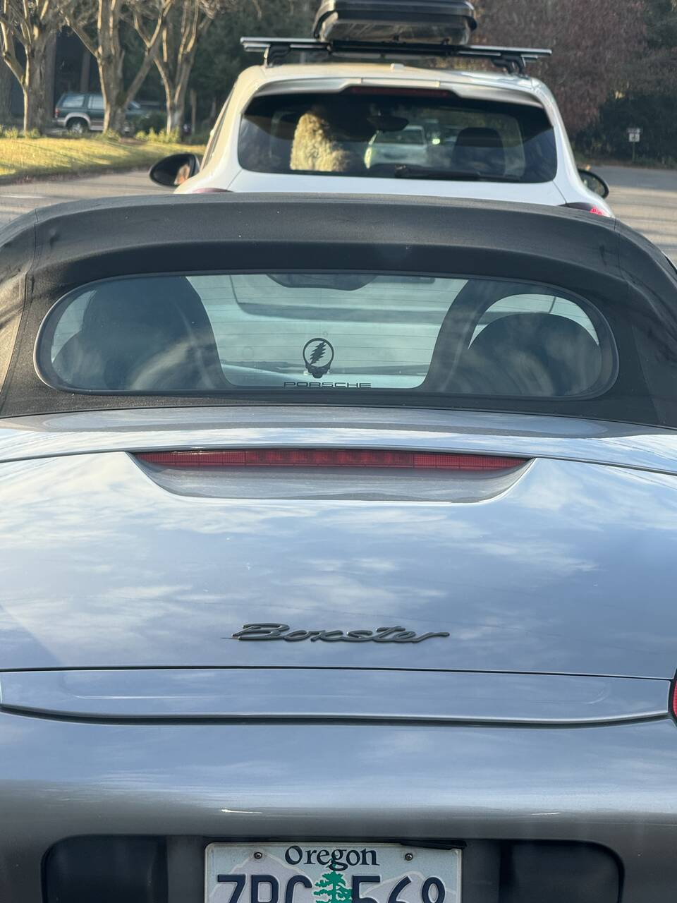
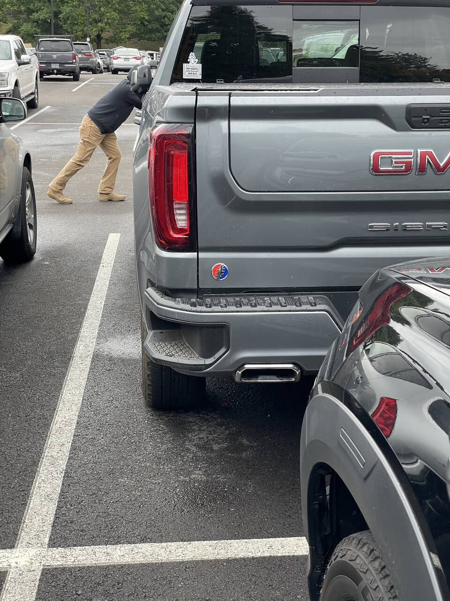

Over the past year, I’ve experienced a resurgence of my love for the Grateful Dead and their music. I’ve listened to almost nothing but Grateful Dead music for the entire year, and I haven’t come even close to getting tired of it.  
  
I’ve picked up my guitar again and have made pretty big strides (for me) in my playing ability. The Dead and their music have shown me what music \*can\* be. I mean, their music is so complex. So much more than a harmony and melody. It’s multiple harmonies, and melodies, being improvised on the spot. It’s a journey. It’s exploration.  
  
As my dive into the Dead’s music has deepened, so has my awareness of how many other folks out there are fans as well.  
  
Below are just a couple decals/signs that I’ve seen around Portland throughout the last several months.  Weir everywhere.  
  

