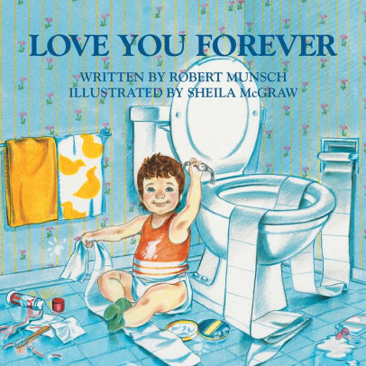

Last night I read "[Love You Forever](https://amzn.to/2Fuougm)" to my 19-month old daughter for the first time. I only made it about half way before I was sobbing. My kid just squirmed around and played with her stuffed animals, as per usual, but I lost it.

My mom read that book to me when I was a little kid, and boy did the emotions come flooding in. If you're a parent, read this book to your kid, and then go give _your_ parents a hug (or a call) if you're lucky enough to still have them around.
